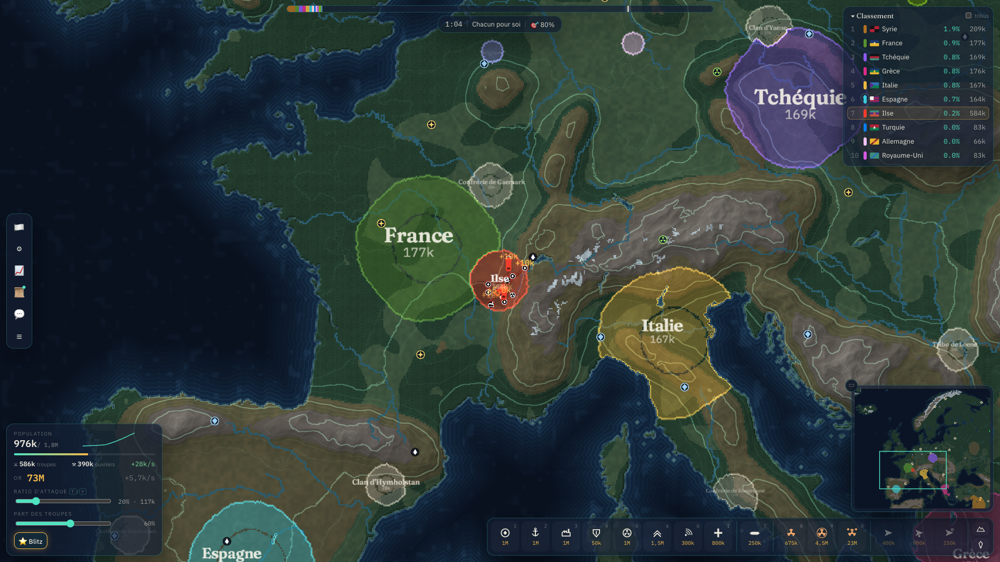

# Isoline

**Conquête territoriale en temps réel sur un atlas vivant.**
*Real-time territorial conquest on a living night atlas.*



Isoline est un jeu de stratégie de bureau (macOS, Windows) au rythme posé : on part d'un point sur une carte du monde réaliste et on étend son territoire face à jusqu'à 100 nations autonomes (avec leur vrai drapeau) et des tribus. Une partie dure de 25 minutes à une heure ; la gestion, les alliances et les trahisons comptent autant que la guerre. Le jeu inclut économie, villes, ports, rail, flottes, aviation, armes nucléaires et diplomatie. Il ajoute une couche originale : météo, brouillard de guerre, technologies, ressources, loyauté et sécessions, généraux, conseil mondial, campagne, éditeur de cartes, replays et multijoueur en réseau local.

- Règles complètes et valeurs chiffrées : [`GAME_DESIGN.md`](GAME_DESIGN.md)
- Identité visuelle : [`BRAND.md`](BRAND.md)
- État du projet, mesures et limites : [`RAPPORT.md`](RAPPORT.md)
- Historique : [`CHANGELOG.md`](CHANGELOG.md) · Licences : [`CREDITS.md`](CREDITS.md)

## Installer le jeu

Les paquets se trouvent dans `dist/` après `npm run package:all`.

| Plateforme | Fichier | Remarque |
|---|---|---|
| macOS 12+ (Intel et Apple Silicon) | `Isoline-<ver>-mac-universal.dmg` (ou `.zip`) | Signature ad hoc, non notarisée. Au premier lancement : clic droit sur l'app → **Ouvrir** → **Ouvrir**, ou `xattr -dr com.apple.quarantine /Applications/Isoline.app`. |
| Windows 10/11 x64 | `Isoline-<ver>-win-x64-setup.exe` | Installeur NSIS (choix du dossier, raccourcis, désinstalleur). SmartScreen : **Informations complémentaires** → **Exécuter quand même**. |
| Windows 10/11 x64 | `Isoline-<ver>-win-x64-portable.exe` | Aucune installation ; les données restent dans `%APPDATA%\Isoline`. |

Le jeu fonctionne entièrement hors ligne. Le multijoueur passe uniquement par le réseau local (aucun serveur externe).

## Développer

### Prérequis
- **Node.js ≥ 20** (développé avec Node 24.19) et npm ≥ 10.
- macOS pour produire le paquet macOS. Les paquets Windows se construisent aussi depuis macOS, sans Wine (NSIS 3.12 fourni par electron-builder, compatible arm64).
- Aucune installation globale : toutes les dépendances sont locales (`node_modules/`), et les caches npm, Electron et electron-builder vont dans `.cache/`.

### Commandes

```bash
npm install            # dépendances locales (npm ≥ 11 : `npm approve-scripts` si demandé)
npm run dev            # Vite (port libre choisi automatiquement) + Electron avec rechargement
npm run build          # renderer (dist-renderer/) + main/preload/serveur (dist-electron/)
npm run package:mac    # dist/Isoline-<ver>-mac-universal.dmg et .zip
npm run package:win    # dist/Isoline-<ver>-win-x64-setup.exe et -portable.exe
npm run package:all    # les deux
npm run verify:packages  # vérifie les paquets et lance l'app macOS en --smoke-test (code 0 attendu)

npm test               # tests unitaires et d'intégration (Vitest, 4 workers max)
npm run test:coverage  # couverture du cœur de simulation (seuil 70 %)
npm run test:e2e       # build puis parcours UI dans Electron (Playwright)
npm run lint           # ESLint (0 avertissement toléré)
npm run typecheck      # tsc strict + svelte-check
npm run bench          # benchmarks sans affichage → docs/bench.json
npm run bench:app      # FPS, mémoire et démarrage mesurés dans l'app → docs/perf-app.json
npm run media          # captures 1920×1080, GIF et vidéo → docs/media/
npm run brand          # régénère logo, icônes, fond de DMG, palettes
npm run maps           # télécharge Natural Earth dans .cache/ne puis régénère assets/maps/
npm run pacing         # durée des parties entre IA (équilibrage)
npm run audio:sfx      # bruitages réels CC0 (Freesound) → public/audio/sfx/
npm run audio:music    # bande-son (Kevin MacLeod, CC BY 4.0) → public/audio/music/
npm run audio:voice    # narration de la campagne (Kokoro TTS, local) → public/voice/
```

Les médias générés (`public/audio`, `public/voice`, 42 Mo) sont versionnés : ces trois scripts ne servent qu'à les régénérer. La voix demande un environnement Python **local au projet** :

```bash
python3 -m venv .tools/venv
.tools/venv/bin/pip install kokoro-onnx soundfile
mkdir -p .cache/tts && cd .cache/tts
curl -LO https://github.com/thewh1teagle/kokoro-onnx/releases/download/model-files-v1.0/kokoro-v1.0.onnx
curl -LO https://github.com/thewh1teagle/kokoro-onnx/releases/download/model-files-v1.0/voices-v1.0.bin
```

Les cartes générées (`assets/maps/`, 25 cartes, 14 Mo) sont versionnées : `npm run maps` n'est nécessaire que pour les modifier (`npm run maps -- balkans,ring` pour n'en reconstruire que certaines). Sources : Natural Earth 1:10m et 1:50m (domaine public), [natural-earth-vector](https://github.com/nvkelso/natural-earth-vector).

### Options de lancement (développement et automatisation)
- `--smoke-test` : ouvre l'écran titre puis quitte avec le code 0 (utilisé par `verify:packages`).
- `ISOLINE_USER_DATA=<dossier>` : dossier de données isolé (tests).
- `ISOLINE_QUERY="autostart=europe&nations=30&spectate&speed=4"` : lance directement une partie. Paramètres : `autostart`, `nations`, `tribes`, `spawn`, `mode`, `difficulty`, `fog`, `gold`, `startGold`, `seed`, `spectate`, `speed`, `zoom`, `x`, `y`, `perf`, `screen`.

## Architecture

```
src/core/      simulation déterministe pure (aucune dépendance au DOM), exécutable sous Node
  map/         terrain, chargement PNG, générateur procédural, navigation navale
  game/        état, constantes, économie, spawn, commandes
  rules/       combat (fronts eikonaux), diplomatie, victoire, technologies, ressources, fonctionnalités inédites
  buildings/ units/ npc/ (IA)  net/ (commandes, hash, snapshots)
src/engine/    Worker de simulation, protocole, tours lockstep, replays, état client
src/render/    PixiJS v8 + shaders GLSL ES 3.0 (carte), sprites, particules, caméra
src/ui/        Svelte 5 : écrans, HUD, i18n FR/EN, réglages, campagne, éditeur
src/audio/     audio procédural (Web Audio) : musique adaptative et effets
src/server/    serveur LAN lockstep (ws) embarqué, découverte UDP
src/desktop/   process principal Electron, préchargement, stockage, IPC
tests/         Vitest (unit/) et Playwright (e2e/)
scripts/       build, packaging, vérification, benchmarks, médias, marque, cartes
```

- **Simulation** : 10 ticks/s dans un Web Worker. PRNG xoshiro128** seedé, aucun `Math.random` dans `src/core` (règle ESLint). L'état est vérifiable par hash et restaurable par snapshot.
- **Rendu** : une seule surface pour toute la carte, avec des textures de données (terrain, relief, propriétaires, état, brouillard) dessinées par un shader : biomes réalistes fondus, ombrage du relief, neiges, profondeur des mers, côtes lissées, territoires translucides à frontières nettes, météo, nuit. Les mises à jour sont partielles, par bandes. Unités vues de dessus et pictogrammes de bâtiments en SVG.
- **Audio** : bruitages enregistrés, musique orchestrale adaptative en fondu enchaîné, narration de la campagne (voir `GAME_DESIGN.md` §20).
- **Réseau** : lockstep. Le serveur relaie les tours et garde une simulation de référence pour valider les commandes, détecter une désynchronisation (hash) et renvoyer un snapshot.

## Contrôles essentiels

Clic gauche : attaquer ou étendre · Clic droit : menu contextuel · Molette ou pincement : zoom · ZQSD/WASD, flèches ou glisser : caméra · 1–6, O, I, 7 : construire · 8 / 9 / 0 : bombes A, H et MIRV · U : inverser la trajectoire des missiles · T/Y : ratio d'attaque · K/L : accepter/refuser une alliance · E : général · Espace / V / R / N : vues terrain, brouillard, ressources, loyauté · Échap : menu. Tous les raccourcis sont remappables (Paramètres → Contrôles) ; liste complète dans `GAME_DESIGN.md` §16.

## Licence

Code sous licence MIT. Icônes Lucide (ISC), drapeaux flag-icons (MIT), polices OFL, données géographiques du domaine public, bruitages CC0, musique de Kevin MacLeod (CC BY 4.0), voix synthétisée avec Kokoro (Apache 2.0). Détail et attributions : [`CREDITS.md`](CREDITS.md).
