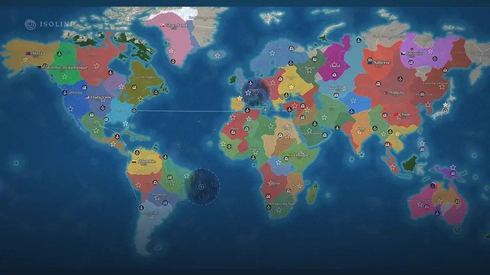
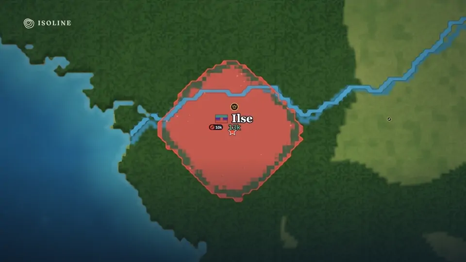
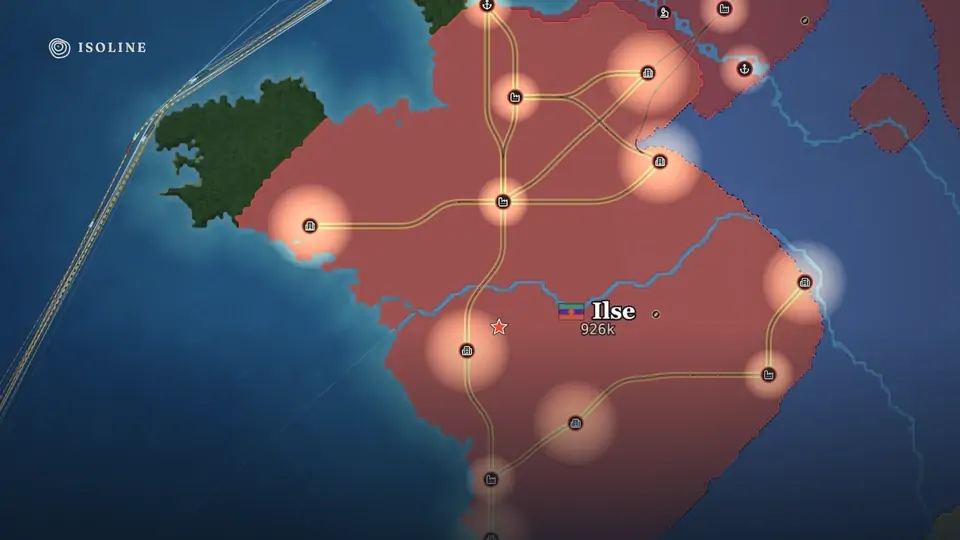
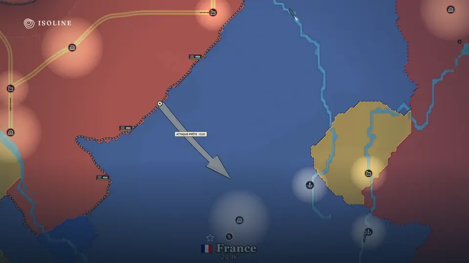
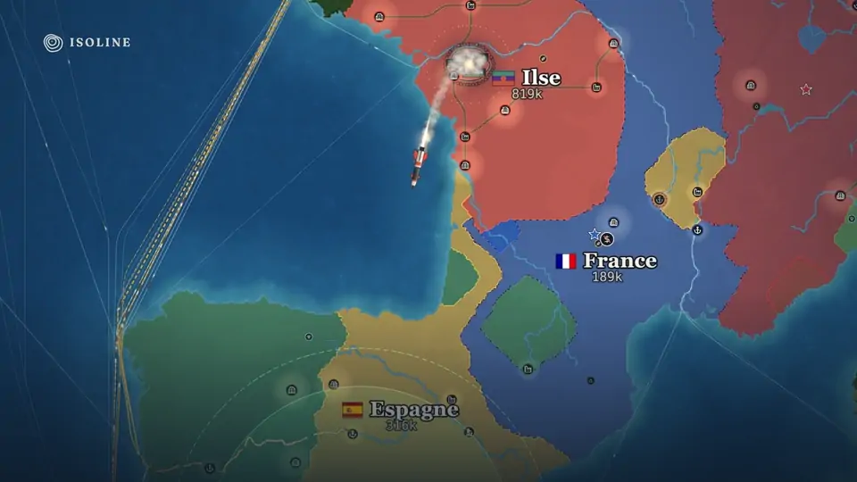

<p align="center">
  <picture>
    <source media="(prefers-color-scheme: dark)" srcset="docs/media/logo-dark.svg" />
    
  </picture>
</p>

<p align="center">
  <b>Trace ta ligne. Tiens le monde.</b><br />
  Stratégie territoriale en temps réel sur une carte du monde vivante.
</p>

<p align="center">
  <a href="https://github.com/Lippou/isoline/releases/latest"></a>
  
  <a href="LICENSE"></a>
</p>

<p align="center">
  <a href="docs/media/trailer.mp4"></a>
  <br />
  <a href="docs/media/trailer.mp4"><b>▶ Bande-annonce (0:45)</b></a>
</p>

Vous partez d'un point sur la carte. Face à vous, des dizaines de nations jouées par l'ordinateur, chacune avec son drapeau, ses alliances et ses ambitions. Étendez vos frontières, bâtissez une économie, tenez vos fronts et frappez au bon moment : une partie se joue en 30 à 60 minutes, et la diplomatie compte autant que la guerre.

<table>
  <tr>
    <td width="50%"></td>
    <td width="50%"></td>
  </tr>
  <tr>
    <td><b>S'étendre.</b> Chaque clic engage une part de vos troupes ; le terrain, les rivières et vos voisins décident du reste.</td>
    <td><b>Bâtir.</b> Villes, usines et ports se relient d'eux-mêmes : trains et navires marchands font votre fortune.</td>
  </tr>
  <tr>
    <td></td>
    <td></td>
  </tr>
  <tr>
    <td><b>Tenir et percer.</b> Retranchez-vous derrière des lignes de défense, puis tirez la flèche de l'assaut là où il doit frapper.</td>
    <td><b>Dissuader.</b> Silos, bombes A et H, défenses antimissiles : l'arme ultime change l'équilibre du monde.</td>
  </tr>
</table>

## Télécharger

Dernière version : **[page des téléchargements](https://github.com/Lippou/isoline/releases/latest)**.

| Système | Fichier |
|---|---|
| macOS 12 ou plus récent (Intel et Apple Silicon) | `Isoline-…-mac-universal.dmg` : signé et notarisé par Apple |
| Windows 10 ou 11 | `Isoline-…-win-x64-setup.exe` (installeur) ou `…-portable.exe` (sans installation) |

Sous Windows, au premier lancement : **Informations complémentaires**, puis **Exécuter quand même**. Les mises à jour se proposent ensuite d'elles-mêmes, dans le jeu.

## Jouer

- **Campagne** : six missions qui apprennent tout le jeu, de la première frontière à la bombe, avec une conseillère qui vous guide.
- **Partie libre** : 41 cartes (monde, continents, régions, cartes imaginaires) et un générateur, plusieurs modes (chacun pour soi, équipes, humains contre nations, battle royale, horloge de l'apocalypse), quatre niveaux de difficulté.
- **À plusieurs** : en réseau local, sans serveur. Depuis chez soi, chacun installe [Tailscale](https://tailscale.com) et rejoint l'adresse « à distance » affichée dans le salon. Tout le monde doit avoir la même version.
- **Et aussi** : météo, nuit, brouillard de guerre, technologies, conseil mondial, révolutions, éditeur de cartes, replays.

Le jeu fonctionne entièrement hors ligne, en français et en anglais.

## Développer

Electron, Svelte 5, PixiJS et TypeScript ; simulation déterministe en lockstep. Pour lancer le jeu depuis les sources :

```bash
npm install
npm run dev
```

Tout le reste : [`docs/DEVELOPMENT.md`](docs/DEVELOPMENT.md). Les règles et leurs valeurs : [`GAME_DESIGN.md`](GAME_DESIGN.md). Les nouveautés : [`CHANGELOG.md`](CHANGELOG.md).

## Licence

Code sous licence [MIT](LICENSE). Polices, musiques (Kevin MacLeod, CC BY 4.0), bruitages, drapeaux et données géographiques sont sous licences libres : voir [`CREDITS.md`](CREDITS.md).
